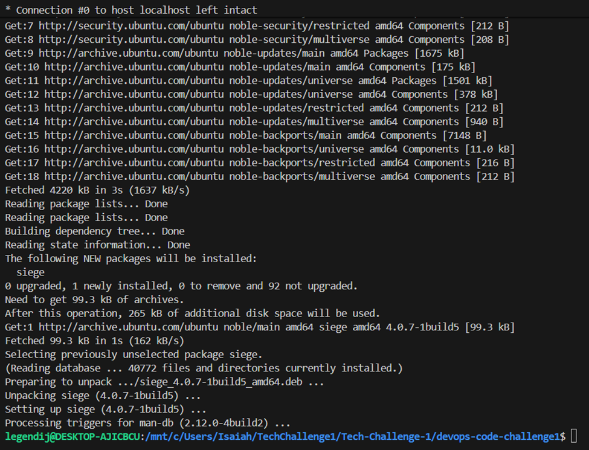

# Tech Challenge 1 – ECS Fargate CI/CD with Jenkins

## Overview

This project deploys a simple **full-stack application** to AWS using:

- **Frontend:** React app (served via ECS Fargate behind an ALB)
- **Backend:** Node.js/Express API returning a `SUCCESS <GUID>` response
- **Containerization:** Docker images pushed to Amazon ECR
- **Orchestration:** Amazon ECS Fargate with Application Load Balancer (ALB)
- **Infrastructure as Code:** Terraform
- **CI/CD:** Jenkins pipeline running on an EC2 instance (Dockerized Jenkins)

The goal is to go from **local development → containers → AWS infrastructure → automated deployments**.

---

## 1. Project Structure

```text
devops-code-challenge1/
├── backend/                 # Node.js/Express API
│   ├── index.js
│   ├── config.js
│   ├── Dockerfile
│   └── package.json
├── frontend/                # React frontend
│   ├── src/
│   ├── public/
│   └── Dockerfile
├── ALB.tf                   # Application Load Balancer + target groups + listeners
├── VPC.tf                   # VPC, subnets, route tables, etc.
├── ECS-Cluster.tf           # ECS cluster + services + task definitions
├── Fargate-AS.tf            # ECS Service autoscaling (frontend & backend)
├── ECR-Repositories.tf      # ECR repos for frontend & backend images
├── IAM.tf                   # IAM roles and policies for ECS and Jenkins
├── Master-JenkinsServer.tf  # EC2 instance used for Jenkins
├── provider.tf              # Terraform provider configuration
├── variables.tf             # Input variables
├── outputs.tf               # Output values (ALB DNS, etc.)
└── Jenkinsfile              # Jenkins pipeline definition
2. Prerequisites

AWS account with permissions to create:
VPC, ALB, ECS, ECR, IAM, EC2
Local tools:
git
terraform (v1.x)
docker
(optional) awscli for manual checks
GitHub repository: legendij/devops-code-challenge1
Jenkins running on an EC2 instance (Dockerized)

3. Local Application Setup (Phase 1)
This phase was used only to validate the app locally before containerization.
# Clone the repo
git clone https://github.com/legendij/devops-code-challenge1.git
cd devops-code-challenge1

Backend (local)
cd backend
npm install
npm start    # or node index.js, depending on package.json script

Backend runs on http://localhost:8080 and returns JSON:
{ "message": "SUCCESS <GUID>" }

Frontend (local)
cd ../frontend
npm install
npm start

Frontend runs on http://localhost:3000 and calls the backend.

4. Terraform Guide (Phases 3–4)
4.1 Initialize Terraform

From the repo root:
terraform init

4.2 Review and set variables

Variables are defined in variables.tf.
You can override them in terraform.tfvars if needed, for example:
project_name    = "tech-challenge-1"
aws_region      = "us-east-1"
min_tasks       = 1
max_tasks       = 3
cpu_threshold   = 50

4.3 Plan
terraform plan -out=tfplan

4.4 Apply
terraform apply tfplan

Terraform will create:

VPC, subnets, IGW, route tables
Application Load Balancer + target groups + listeners
ECS cluster and Fargate services (frontend & backend)
ECR repositories (frontend/backend)
IAM roles for ECS tasks and Jenkins
EC2 instance for Jenkins

4.5 Useful Terraform Outputs
Typical outputs include:
alb_dns_name – Public URL for the frontend
http://<ALB_DNS>
(Optional) other IDs/ARNs used by Jenkins or debugging

5. Jenkins Setup (Phase 5–7)
5.1 Jenkins Host
EC2 instance type: t3.small
OS: Amazon Linux 2023
Jenkins runs in Docker:
docker run -d --name jenkins \
  -p 8080:8080 -p 50000:50000 \
  -v jenkins_home:/var/jenkins_home \
  jenkins/jenkins:lts

To make Jenkins restart automatically:
docker update --restart=always jenkins

Jenkins is available at:
http://100.48.237.72:8080

5.2 Jenkins Credentials

GitHub: personal access token used for git operations
ECR / AWS: IAM credentials or role used by Jenkins to:
Build Docker images
Login to ECR
Push images
Register new ECS task definitions
Update ECS services

5.3 Jenkins Pipeline (Jenkinsfile)
The pipeline performs the following stages:
Checkout code
Pulls from main branch of legendij/devops-code-challenge1.
Build Docker images
Builds frontend and backend images using their Dockerfiles.
Push images to ECR
Tags images with repo URI and commit SHA.
Pushes to the appropriate ECR repositories.
Register new ECS task definitions
Creates new task definitions for frontend and backend services
Binds them to the new image tags.
Update ECS services
Updates ECS services to use the latest task definitions.
Triggers rolling deployment via ECS.

The pipeline is triggered by:
Manual runs in Jenkins
GitHub webhook on pushes to main

6. ALB & Service Routing
ALB DNS: http://devops-challenge-alb-151485846.us-east-1.elb.amazonaws.com

Listener rules:
Default (/) → forwards to frontend target group
Path /api/* → forwards to backend target group
Backend Endpoints
GET /health → returns 200 OK with JSON { "status": "healthy" }
(used by ALB health checks)
GET /api/ → returns 200 OK with JSON { "message": "SUCCESS <GUID>" }

CORS Configuration
backend/config.js:
module.exports = {
  CORS_ORIGIN: "http://devops-challenge-alb-151485846.us-east-1.elb.amazonaws.com"
};

frontend/src/config.js:
const config = {
  backendUrl: "http://devops-challenge-alb-151485846.us-east-1.elb.amazonaws.com/api/"
};

export default config;

7. Autoscaling & Load Testing (Phase 7)
Autoscaling is configured in Fargate-AS.tf for both frontend and backend services:
Min tasks: var.min_tasks
Max tasks: var.max_tasks
Policy: Target tracking on ECSServiceAverageCPUUtilization
CPU threshold: var.cpu_threshold (e.g. 50%)

Scaling Test (example)

Load test tool: siege or similar (optional)

Observations:
When CPU > threshold, ECS scaled from 1 → N tasks.
When load decreased, ECS scaled tasks back down toward the minimum.

During testing, a sustained load on the frontend caused the ECS service to scale from 1 task to 3 tasks based on CPU utilization. After traffic stopped, the service gradually scaled back down to 1 task, confirming autoscaling worked as expected.

8. How to Run / Redeploy
Push code to main:
git add .
git commit -m "Your change summary"
git push origin main

GitHub webhook triggers Jenkins.

Jenkins pipeline:
Builds new images
Pushes to ECR
Updates ECS task definitions and services
Visit the application at:
Frontend: http://devops-challenge-alb-151485846.us-east-1.elb.amazonaws.com
Backend:  http://devops-challenge-alb-151485846.us-east-1.elb.amazonaws.com/api/


9. Useful URLs for Submission
Jenkins URL: http://100.48.237.72:8080
Frontend URL (ALB DNS): http://http://devops-challenge-alb-151485846.us-east-1.elb.amazonaws.com
GitHub Repo (private): https://github.com/legendij/devops-code-challenge1


---

Before you save, update:

- `http://http://devops-challenge-alb-151485846.us-east-1.elb.amazonaws.com` → your actual ALB DNS
- `100.48.237.72` → your Jenkins EC2 public IP
- Any scaling results text → tweak to match what you actually saw
